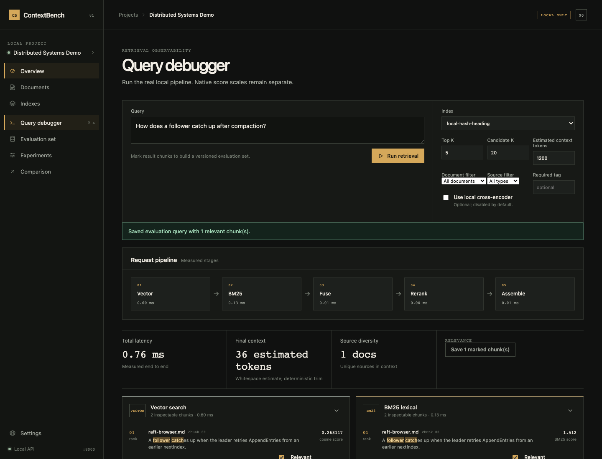

# ContextBench

Debug and measure your RAG pipeline instead of guessing whether retrieval works.

ContextBench is a local-first retrieval evaluation workbench. It shows what vector search,
BM25, reciprocal rank fusion, and an optional cross-encoder returned. It also measures those
rankings against chunk-level relevance judgments. The workbench centers on retrieval evidence
and measured rankings.



## What works in V1

- Ingest TXT, Markdown, PDF, and common source files without executing them.
- Normalize Unicode and keep document, heading, page, character range, and chunk position.
- Compare fixed-token, paragraph-aware, and heading-aware chunking.
- Keep several frozen index configurations in one project.
- Store vectors in persisted Qdrant local collections with document, type, and tag filters.
- Run a compact local Sentence Transformers model or the zero-download hash provider.
- Inspect native vector scores, native BM25 scores, deterministic RRF scores, and ranks.
- Optionally rerank a full candidate set with a local cross-encoder.
- Build versioned evaluation queries by marking relevant chunks in the Query Debugger.
- Compute Recall@K, Precision@K, MRR, Hit Rate@K, and nDCG@K.
- Persist and compare experiment configurations, rankings, metrics, and measured latency.
- Export evaluation data and experiment results as versioned JSON.
- Optionally ask an existing local Ollama model to answer from cited retrieved evidence.

The core workflow needs no LLM, cloud service, account, API key, telemetry, or payment.

## Quick start

Requirements: Python 3.12 or newer, `uv`, Node 22 or newer, and npm.

```bash
git clone https://github.com/mateoosoriodelhonte/contextbench.git
cd contextbench
uv sync --extra dev
cd frontend
npm ci --ignore-scripts
npm run build
cd ..
uv run contextbench serve
```

Open `http://127.0.0.1:8000/projects`. Choose **Load real demo** for a deterministic local
corpus, hash vectors, and relevance judgments. This path downloads no ML model.

ContextBench stores its state under `.contextbench/` by default. Both servers bind to
`127.0.0.1`.

## CLI

The CLI and web app use the same Python retrieval and evaluation code.

```bash
uv run contextbench project create "RAG notes"
uv run contextbench ingest PROJECT_ID ./notes/raft.md
uv run contextbench index PROJECT_ID --chunk-size 256 --overlap 32
uv run contextbench query PROJECT_ID INDEX_ID "How does log repair work?"
uv run contextbench eval PROJECT_ID INDEX_ID --json
uv run contextbench compare EXPERIMENT_A EXPERIMENT_B
uv run contextbench benchmark --corpus-size 200 --query-count 20
```

`eval --json`, experiment exports, evaluation exports, and the benchmark use named versioned
schemas for CI and agent workflows.

## Local models and consent

The recommended semantic model is `BAAI/bge-small-en-v1.5` at 384 dimensions. The optional
reranker is `cross-encoder/ms-marco-MiniLM-L6-v2`. The web app shows the model name,
approximate download size, and normal Hugging Face cache location before it lets a request
download either model. A cached model can run without download consent. ContextBench never
pulls an Ollama model.

Install the optional local ML runtime with `uv sync --extra ml`. Successful index builds record
the resolved model revision so later query embeddings use the same weights.

The built-in hash provider is deterministic and useful for the demo, tests, and pipeline
checks. Semantic-quality evaluation requires a semantic embedding model.

## Retrieval math

BM25 and vector scores stay on their native scales. Hybrid retrieval uses reciprocal rank
fusion:

```text
RRF(d) = sum(1 / (60 + rank_i(d)))
```

The evaluation layer uses only stored relevance judgments. It does not ask an LLM to grade
retrieval and does not invent a combined “RAG quality” score. See
[Evaluation metrics](docs/EVALUATION_METRICS.md) and
[Hybrid retrieval](docs/HYBRID_RETRIEVAL.md).

## Privacy and security

Documents, chunks, vectors, queries, and experiments stay in local SQLite and Qdrant files.
The app has no analytics or telemetry. Uploads are size-limited and extension-checked.
Filenames cannot contain paths. Source files are data, not executable code. The UI renders
document text as text nodes. Optional Ollama prompts label retrieved text as untrusted evidence
and reject uncited or spoofed citations. The API rejects non-loopback Host headers.

See [Privacy](docs/PRIVACY.md) and [Security policy](SECURITY.md).

## Verification

The repository includes:

- hand-computed metric tests;
- chunking, normalization, BM25, RRF, filtering, context, and reranker tests;
- fixture-to-index-to-retrieval-to-evaluation API tests;
- SolidJS component and API-client tests;
- a Playwright Page Object Model test for the complete user flow;
- Python format, lint, strict type, test, coverage, and package-build gates;
- frontend format, lint, type, test, build, dependency-audit, and browser gates.

The default benchmark runs the real hash embedding, Qdrant local, BM25, and hybrid paths on
the current machine. It marks cross-encoder timing `NOT_RUN` unless that model is tested
separately.

## Documentation

- [Architecture](ARCHITECTURE.md)
- [RAG pipeline](docs/RAG_PIPELINE.md)
- [Chunking](docs/CHUNKING.md)
- [Embeddings](docs/EMBEDDINGS.md)
- [Reranking](docs/RERANKING.md)
- [API contract](docs/API_CONTRACT.md)
- [Local development](docs/LOCAL_DEVELOPMENT.md)
- [Contributing](CONTRIBUTING.md)

ContextBench is licensed under Apache 2.0.
